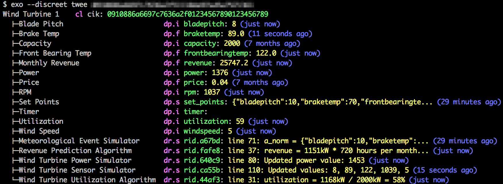

Exoline
=======

Exoline is a command line interface for the Exosite [One Platform](http://exosite.com/products/onep). 



Installation 
------------

Install the latest released version of Exoline from PyPI. 

```
    $ sudo pip install exoline
```

pip is a package manager for Python. To get pip, try `sudo easy_install pip` in Mac OS X,  `sudo apt-get install python-setuptools;sudo easy_install pip` in Ubuntu. See below for Windows instructions.

Here's how to install from source:

```
    $ git clone git://github.com/exosite/exoline
    $ cd exoline
    $ python setup.py install
```

[virtualenvwrapper](http://virtualenvwrapper.readthedocs.org/en/latest/) is a great way to manage Python environments and avoid needing to use sudu for package installs.

Exoline supports Python 2.6 and above. (Tests run against 2.6, 2.7, 3.2, 3.3, and 3.4)

Installation - Windows
----------------------

For a Windows installer, look [here](https://github.com/exosite/exoline/releases/).

To install from PyPI, first install the prerequisites:

- [Python](http://www.python.org/downloads/windows/)

- [pip-win](https://sites.google.com/site/pydatalog/python/pip-for-windows) (Alternatively, you can install [setuptools](https://pypi.python.org/pypi/setuptools) and [pip](https://pypi.python.org/pypi/pip) individually. pip-win just saves a few steps.)

After pip-win is installed, a GUI window will pop up. To install Exoline, type
`pip install exoline` into the command field.

Upgrading
---------
To upgade your version of exoline you can use the following command. 

```
    $ sudo pip install exoline --upgrade
```

Usage
-----

```
Exosite RPC API Command Line Interface
   Provides command line access to the Remote Procedure Call API:
   https://github.com/exosite/docs/tree/master/rpc

Usage:
  exo [--help] [options] <command> [<args> ...]

Commands:
  read           Read data from a resource.
  write          Write data at the current time.
  record         Write data at a specified time.
  create         Create a resource from a json description passed on stdin (with -),
                 or using command line shorthand (other variants).
  listing        List the RIDs of a client's children.
  info           Get metadata for a resource in json format.
  update         Update a resource from a json description passed on stdin.
  map            Add an alias to a resource.
  unmap          Remove an alias from a resource.
  lookup         Look up a resource's RID based on its alias cik.
  drop           Drop (permanently delete) a resource.
  flush          Remove time series data from a resource.
  usage          Display usage of One Platform resources over a time period.
  tree           Display a resource's descendants.
  twee           Display a resource's descendants. Like tree, but more wuvable.
  script         Upload a Lua script
  spark          Show distribution of intervals between points.
  copy           Make a copy of a client.
  diff           Show differences between two clients.
  ip             Get IP address of the server.
  data           Read or write with the HTTP Data API.
  portals        Invalidate the Portals cache for a CIK by telling Portals
                 a particular procedure was taken on client identified by <cik>.
  share          Generate a code that allows non-owners to access resources
  revoke         Revoke a share code or CIK
  activate       Activate a share code or CIK
  deactivate     Deactivate a share code or expire a CIK
  clone          Create a clone of a client
  makeShortcuts  Build a list of shortcuts from a client
  ndup           Duplicate a value in a dataport
  spec           Determine whether a client matches a specification (beta)
  transform      Transform data on in a dataport by mapping all values (alpha)

Options:
  --host=<host>        OneP host. Default is $EXO_HOST or m2.exosite.com
  --port=<port>        OneP port. Default is $EXO_PORT or 443
  --config=<file>      Config file [default: ~/.exoline]
  --httptimeout=<sec>  HTTP timeout [default: 60] (default for copy is 480)
  --https              Enable HTTPS (deprecated, HTTPS is default)
  --http               Disable HTTPS
  --useragent=<ua>     Set User-Agent Header for outgoing requests
  --debug              Show debug info (stack traces on exceptions)
  -d --debughttp       Turn on debug level logging in pyonep
  --discreet           Obfuscate RIDs in stdout and stderr
  -c --clearcache      Invalidate Portals cache after running command
  --portals=<server>   Portals server [default: https://portals.exosite.com]
  -h --help            Show this screen
  -v --version         Show version

See 'exo <command> --help' for more information on a specific command.
```


Examples
--------

Show a tree view of a client

```
$ exo tree 5de0cfcf7b5bed2ea7a801234567890123456789
Dev client cik: 5de0cfcf7b5bed2ea7a801234567890123456789 (aliases: (see parent))
  ├─device1 client cik: 970346d3391a2d8c703a01234567890123456789 (aliases: ['device1'])
  └─device2 client cik: e95052ab56f985e6807d01234567890123456789 (aliases: ['device2'])
      └─json string dataport rid: 82209d5888a3bd1530d201234567890123456789 (aliases: ['json'])
```

Show a tree view of a client with values

```
$ exo tree 2ca4f441538c1f2cc8bf01234567890123456789 --values
ArduinoWifi  client cik: 2ca4f441538c1f2cc8bf01234567890123456789 (aliases: see parent)
  ├─event        string  dataport rid: f264984bc4f9cf205e8801234567890123456789 (aliases: ["event"], value: button/1 years ago)
  ├─gas          integer dataport rid: 5c9d695fdbe1503c662201234567890123456789 (aliases: ["gas"], value: 263/1 years ago)
  ├─Humidity     float   dataport rid: 4fa572ba020cd921038801234567890123456789 (aliases: ["humidity"], value: 71.7/1 years ago)
  ├─Image URL    string  dataport rid: 76143aaf0930802775e201234567890123456789 (aliases: ["image-url"], value: http://exosite.co.../1 years ago)
  ├─light        integer dataport rid: 8dc131ea3fff528b122301234567890123456789 (aliases: ["light"], value: 1/1 years ago)
  ├─Metadata     string  dataport rid: e93eea75d58615e78e8f01234567890123456789 (aliases: ["metadata"], value: {"foo":"bar","baz.../1 years ago)
  └─Temperature  float   dataport rid: 3bbee56c446f546b546901234567890123456789 (aliases: ["temperature"], value: 22/1 years ago)
```

Write a Lua script

```
    $ exo script translate_gps.lua e469e336ff9c8ed9176bc05ed7fa40daaaaaaaaa     
    Updated script RID: 6c130838e14903f7e12d39b5e76c8e3aaaaaaaaa
```

Read a Lua script (with help from the awesome [jq](http://stedolan.github.io/jq/))

```
    $ exo info e469e336ff9c8ed9176bc05ed7fa40daaaaaaaaa translate_gps.lua --include=description | jq -r .description.rule.script 
```

Monitor output of a script

```
    $ exo read e469e336ff9c8ed9176bc05ed7fa40daaaaaaaaa translate_gps.lua --follow 
    2013-07-09 11:57:45,line 2: Running translate_gps.lua...
    2013-07-09 12:00:17,"line 12: New 4458.755987,N,09317.538945,W
    line 23: Writing 4458.755987_-09317.538945"
    2013-07-09 12:15:41,"line 12: New 4458.755987,N,09317.538945,W
    line 23: Writing 4458.755987_-09317.538945"
```

Write raw data

```
    $ exo write e469e336ff9c8ed9176bc05ed7fa40daaaaaaaa gps-raw --value=4458.755987,N,09317.538945,W
```

Record a bunch of data without timestamps

```
    $ cat myrawgps | exo record e469e336ff9c8ed9176bc05ed7fa40daaaaaaaaa gps-raw - 
```

Dump data from multiple dataports to CSV

```
    $ time ./exo.py read 2ca4f441538c1f2cc8bfaaaaaaaaaaaaaaaaaaaa gas temperature humidity event --start=5/1/2013 --end=8/1/2013 --chunkhours=24 > alldata.csv

    real    1m58.377s
    user    0m10.981s
    sys     0m0.506s

    $ wc -l alldata.csv
      316705 alldata.csv
```

Make a clone of device with RID ed6c3f... into portal with CIK e469e3...

```
    $ exo clone e469e336ff9c8ed9176bc05ed7fa40daaaaaaaaa --rid=ed6c3facb6a3ac68c4de9a6996a89594aaaaaaaa
    cik: c81e6ae0fbbd7e9635aa74053b3ab6aaaaaaaaaa
    rid: 9635aa74053b3ab681e6ae0fb8187a0000000000
```

Copy a device with CIK e469e3... to a different portal with CIK ed6c3f... Note that whereas clone can clone all types of devices and device data within the same portal, copy is somewhat limited in the types of devices it supports but can do inter-portal copies.

```
    $ exo copy e469e336ff9c8ed9176bc05ed7fa40daaaaaaaaa ed6c3facb6a3ac68c4de9a6996a89594aaaaaaaa
    cik: c81e6ae0fbbd7e9635aa74053b3ab6aaaaaaaaaa
    rid: 9635aa74053b3ab681e6ae0fb8187a0000000000
```

Create a new client or resource

```
    $ exo create ad02824a8c7cb6b98fdfe0a9014b3c0faaaaaaaa --type=dataport --format=string --alias=stringport --name="Original Name"
    rid: 34eaae237988167d90bfc2ffeb666daaaaaaaaaa
```

Update a the name of a resource

```
    $ echo '{"name":"New Name"}' | exo update ad02824a8c7cb6b98fdfe0a9014b3c0faaaaaaaa stringport -
```

Get the RID for CIK ad0282...

```
    $ exo lookup ad02824a8c7cb6b98fdfe0a9014b3c0faaaaaaaa
    34eaae237988167d90bfc2ffeb666daaaaaaaaaa
```

Show differences between two clients

```
    $ exo copy 3ae52bdd5280d7cb96a2077b0cd5aaaaaaaaaaaa 5de0cfcf7b5bed2ea7a802ebe0679baaaaaaaaaa
    cik: cc080a86b1c9b53d5371e0fa793faaaaaaaaaaa
    $ exo diff 3ae52bdd5280d7cb96a2077b0cd5aaaaaaaaaaaa cc080a86b1c9b53d5371e0fa793f1daaaaaaaaaa
    $ exo create cc080a86b1c9b53d5371e0fa793f1aaaaaaaaaaa --type=dataport --format=float --name=Humidity
    rid: 6a8974d3d7d1f0ffd28385c90a1bebaaaaaaaaaa
    $ ../exoline/exo.py diff 3ae52bdd5280d7cb96a2077b0cd5dbaaaaaaaaaa cc080a86b1c9b53d5371e0fa793f1daaaaaaaaaa
    {
        "<<RID>>": {
        "aliases": {
            "<<RID>>": [
            "temp"
            ]
        }, 
        "basic": {
            "subscribers": 0, 
            "type": "client"
        }, 
        "children": {
            "<<RID>>": {
    +         "basic": {
    +           "subscribers": 0, 
    +           "type": "dataport"
    +         }, 
    +         "children": {}, 
    +         "comments": [], 
    +         "description": {
    +           "format": "float", 
    +           "meta": "", 
    +           "name": "Humidity", 
    +           "preprocess": [], 
    +           "public": false, 
    +           "retention": {
    +             "count": "infinity", 
    +             "duration": "infinity"
    +           }, 
    +           "subscribe": null
    +         }, 
    +         "shares": [], 
    +         "subscribers": [], 
    +         "tags": []
    +       }, 
    +       "Temperature.f2a40b81cb677401dffdc2cfad0f8a266d63590b": {
            "basic": {
                "subscribers": 0, 
                "type": "dataport"
            }, 
            "children": {}, 
            "comments": [], 
            "description": {
                "format": "float", 
                "meta": "", 
                "name": "Temperature", 
                "preprocess": [], 
                "public": false, 
                "retention": {
                "count": "infinity", 
                "duration": "infinity"
                }, 
                "subscribe": null
            }, 
            "shares": [], 
            "subscribers": [], 
            "tags": []
            }
        }, 
        "comments": [], 
        "counts": {
            "client": 0, 
    -       "dataport": 1, 
    ?                   ^
    +       "dataport": 2, 
    ?                   ^
            "datarule": 0, 
            "dispatch": 0
        }, 
        "description": {
            "limits": {
            "client": "inherit", 
            "dataport": "inherit", 
            "datarule": "inherit", 
            "disk": "inherit", 
            "dispatch": "inherit", 
            "email": "inherit", 
            "email_bucket": "inherit", 
            "http": "inherit", 
            "http_bucket": "inherit", 
            "share": "inherit", 
            "sms": "inherit", 
            "sms_bucket": "inherit", 
            "xmpp": "inherit", 
            "xmpp_bucket": "inherit"
            }, 
            "locked": false, 
            "meta": "", 
            "name": "MyDevice", 
            "public": false
        }, 
        "shares": [], 
        "subscribers": [], 
        "tagged": [], 
        "tags": []
        }
    }
```

See the HTTP requests and responses being made by pyonep:

```
$ exo --debughttp --discreet read <cik> temperature
DEBUG:pyonep.onep:POST /api:v1/rpc/process
Host: m2.exosite.com:80
Headers: {'Content-Type': 'application/json; charset=utf-8'}
Body: {"calls": [{"id": 70, "procedure": "read", "arguments": [{"alias": "temperature"}, {"sort": "desc", "selection": "all", "limit": 1, "endtime": 1376943416, "starttime": 1}]}], "auth": {"cik": "2ca4f441538c1f2cc8bf01234567890123456789"}}
DEBUG:pyonep.onep:HTTP/1.1 200 OK
Headers: [('date', 'Mon, 19 Aug 2013 20:16:53 GMT'), ('content-length', '54'), ('content-type', 'application/json; charset=utf-8'), ('connection', 'keep-alive'), ('server', 'nginx')]
Body: [{"id":70,"status":"ok","result":[[1376819736,24.1]]}]
2013-08-18 04:55:36,24.1
```

Share a dataport with another client.

```
# we want to share client1/dataport1 with client2
$ exo tree wb
Dev client cik: 5de0cf0000000000000000000000000000000000 (aliases: (see parent))
  ├─client1 client cik: 0a35320000000000000000000000000000000000 (aliases: [u'client1'])
  │   └─dataport1 string dataport rid: 4775090000000000000000000000000000000000 (aliases: [u'dataport1'])
  └─client2 client cik: c2d4f30000000000000000000000000000000000 (aliases: [u'client2'])

# generate a share code
$ exo share 0a35320000000000000000000000000000000000 dataport1
e9a52a0000000000000000000000000000000000

# activate the share code
$ exo activate c2d4f30000000000000000000000000000000000 --share=e9a52a0000000000000000000000000000000000

# share appears in tree
$ exo tree wb
Dev client cik: 5de0cf0000000000000000000000000000000000 (aliases: (see parent))
  ├─client1 client cik: 0a35320000000000000000000000000000000000 (aliases: [u'client1'])
  │   └─dataport1 string dataport rid: 4775090000000000000000000000000000000000 (aliases: [u'dataport1'])
  └─client2 client cik: c2d4f30000000000000000000000000000000000 (aliases: [u'client2'])
      └─dataport1 string dataport rid: 4775090000000000000000000000000000000000 

# listing shows owned children by default (not shares)
$ exo listing c2d4f30000000000000000000000000000000000
{"dataport": [], "datarule": [], "client": [], "dispatch": []}

# ...unless you filter for activated shares
$ exo listing c2d4f30000000000000000000000000000000000 --filter=activated
{"dataport": ["4775090000000000000000000000000000000000"], "datarule": [], "client": [], "dispatch": []}

# write to the shared dataport from its owner
$ exo write 0a35320000000000000000000000000000000000 dataport1 --value="Share me"

# you can read the dataport from the non-owner
$ exo read c2d4f30000000000000000000000000000000000 4775090000000000000000000000000000000000
2013-12-13 11:34:13-06:00,Share me

# ...but you can't write from a non-owner
$ exo write c2d4f30000000000000000000000000000000000 4775090000000000000000000000000000000000 --value="Non-owner can't write"
One Platform error: restricted

# look up RID for a share code
$ exo lookup c2d4f30000000000000000000000000000000000 --share e9a52a0000000000000000000000000000000000
4775090000000000000000000000000000000000

# the non-owner can deactivate a share code
$ exo deactivate c2d4f30000000000000000000000000000000000 --share=e9a52a0000000000000000000000000000000000

# now the share is gone
$ exo tree wb
Dev client cik: 5de0cf0000000000000000000000000000000000 (aliases: (see parent))
  ├─client1 client cik: 0a35320000000000000000000000000000000000 (aliases: [u'client1'])
  │   └─dataport1 string dataport rid: 4775090000000000000000000000000000000000 (aliases: [u'dataport1'])
  └─client2 client cik: c2d4f30000000000000000000000000000000000 (aliases: [u'client2'])

# the owner may also revoke the share code. This makes it unusable.
$ exo revoke 0a35320000000000000000000000000000000000 --share=e9a52a0000000000000000000000000000000000
ok
```


Environment Variables
---------------------

For convenience, several command line options may be replaced by environment variables.

* EXO\_HOST: host, e.g. m2.exosite.com. This supplies --host to exo and --url for exodata.
* EXO\_PORT: port, e.g. 80. Currently this only applies to exo, not exodata.


CIK Shortcuts
-------------

Store your commonly used CIKs in a file:

```
$ printf "keys:\n" > ~/.exoline
$ printf "    foo: 2ca4f441538c1f2cc8bf01234567890123456789\n" >> ~/.exoline
$ exo read foo temperature
2013-08-18 04:55:36,24.1
```

Help 
----

For help, run each command with -h from the command line.

Portals
-------

Portals caches One Platform data, so changes made in Exoline may take up to 15 minutes to show up in Portals. You can work around this by passing `--clearcache` (or `-c`). This option tells Exoline to clear the relevent cached information in Portals.

```
$ exo --clearcache create <cik> --type=client
```

If you're using Portals on a different server, pass `--portals` to specify that server.

```
exo --clearcache --portals=https://myportals.com create <cik> --type=dataport --format=string
```

It's also possible to invalidate the cache directly.

```
$ exo portals clearcache <cik>
```

Usage as a Library
------------------

Exoline can be directly imported and used in Python as a library. There are two patterns 
for doing this. First, you can call `exo.run` with whatever arguments you would have 
passed on the command line, plus an optional string stdin parameter.

```python

from exoline import exo

result = exo.run(['exo', 
                  'script', 
                  'scripts/myscript.lua', 
                  'ad02824a8c7cb6b98fdfe0a9014b3c0faaaaaaaa'])

print(result.exitcode)    # 0
print(result.stdout)      # Updated script RID: c9c6daf83c44e44985aa724fea683f14eda71fac
print(result.stderr)      # <no output> 
```

It's also possible to use Exoline's wrapper for the pyonep library, which covers a lot of
Exoline's functionality.

```python

from exoline import exo

rpc = exo.ExoRPC()
 
rpc.upload_script(ciks=['ad02824a8c7cb6b98fdfe0a9014b3c0faaaaaaaa'], 
                  filename='scripts/myscript.lua')
```


Issues/Feature Requests
-----------------------

If you see an issue with exoline or want to suggest an improvement, please log it [here](https://github.com/exosite/exoline/issues).


Test
----

Exoline comes with integration tests that cover ~80% of code. To run the tests, see [test/README.md](test/README.md).


Building for Windows
--------------------

You can build Exoline as a Windows executable. On a Windows machine, do this:

- install Python (make sure bitness matches the machine. pywin32 cares about this.)
- [pip-win](https://sites.google.com/site/pydatalog/python/pip-for-windows)
- install pywin32
- install PyInstaller (`pip install pyinstaller`)
- in the Exoline root directory, run (`pyinstaller exo.spec`)
- `exo.exe` and its dependencies are in dist\exo\
- run `copy dist\exo\exo.exe dist\exo\exo` so that Windows users don't need to type .exe

Build the installer this way:

- install Inno Setup 5.5.4 from here: http://www.innosetup.com/
- open innosetup.iss
- update Source in the Files section to point to dist\exo folder on your system

What's New?
-----------

For information about what features are in what Exoline versions look [here](HISTORY.md).


TODO
----

- differentiate dataport and client shares in tree command (this is important now that I'm using non-deprecated form of listing command)
- --name parameter to copy command so names don't conflict
- add raw command, taking full RPC json from stdin
- Make the info command take multiple rids (or stdin)
- delete serial number when dropping device
- add --howmany option to create command
- tab completion for commands and shortcuts
- add dataport creation shorthand: "exo create <cik> <alias and name> [datatype]". `exo create mydevice foo` would create a dataport of format string with alias and name both set to foo. `exo create mydevice bar float` would create a float-valued dataport.
- add test for --tz option
- add the option of using requests to authenticate with https (see warning here: http://docs.python.org/2/library/httplib.html)
- create executable and installer for a better Windows experience
- support datasources with subscribe
- new command to do resource ancestry lookup 
- add a --monitor (or --follow) option to script command
- add support for https://github.com/exosite/docs/tree/master/rpc#authentication like this: $ exo info cik1,client_id=rid1
- add --timeformat=excel option for Excel import. Instead of "2014-03-13 15:53:20-05:00,<value>" it would output "2014-03-13 15:53:20,-05:00,<value>"
- make ip and data commands support https, host, and port settings and remove noconfig=True workaround in those tests
- fix install warning: "UserWarning: Unknown distribution option: 'console'"
- support 'brew install exoline' in OSX
- add command line interaction animated gif to README
- marketing stuff (blog post)
- make exoline<tab> autocompletion work in iPython
