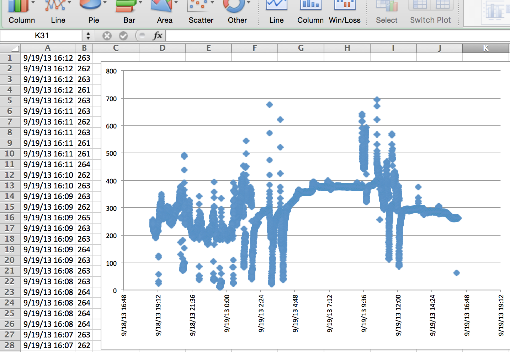
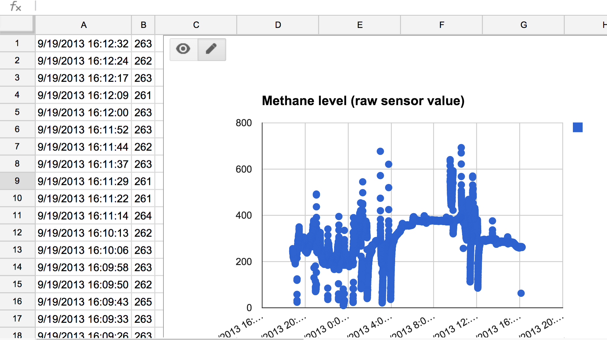

Exoline
=======
[](http://badge.fury.io/py/exoline) []() [](https://gitter.im/exosite/exoline?utm_source=badge&utm_medium=badge&utm_campaign=pr-badge&utm_content=badge)

Exoline is a command line interface for the Exosite [One Platform](http://exosite.com/products/onep). 


Installation 
------------

Install the latest released version of Exoline from PyPI. 

```
$ sudo pip install --upgrade exoline
```

pip is a package manager for Python. To get pip, try `sudo easy_install pip` in Mac OS X,  `sudo apt-get install python-setuptools;sudo easy_install pip` in Ubuntu. See below for Windows instructions.

Here's how to install from source:

```
$ git clone git://github.com/exosite/exoline
$ cd exoline
$ python setup.py install
```

[virtualenvwrapper](http://virtualenvwrapper.readthedocs.org/en/latest/) is a great way to manage Python environments and avoid needing to use sudu for package installs.

Exoline supports Python 2.6 and above. (Tests run against 2.6, 2.7, 3.2, 3.3, and 3.4.)

Installation - Windows
----------------------

For a Windows installer, look [here](https://github.com/exosite/exoline/releases/).

To install from PyPI, first install the prerequisites:

- [Python](http://www.python.org/downloads/windows/)

- [pip-win](https://sites.google.com/site/pydatalog/python/pip-for-windows) (Alternatively, you can install [setuptools](https://pypi.python.org/pypi/setuptools) and [pip](https://pypi.python.org/pypi/pip) individually. pip-win just saves a few steps.)

After pip-win is installed, a GUI window will pop up. To install Exoline, type
`pip install exoline` into the command field.

Upgrading
---------
To upgade your version of exoline you can use the following command. 

```
$ sudo pip install exoline --upgrade
```

Usage
-----

```
Exoline - Exosite IoT Command Line Interface
https://github.com/exosite/exoline

Usage:
  exo [--help] [options] <command> [<args> ...]

Commands:
  read           Read data from a resource.
  write          Write data at the current time.
  record         Write data at a specified time.
  create         Create a resource from a json description passed on stdin (with -),
                 or using command line shorthand (other variants).
  listing        List the RIDs of a client's children.
  info           Get metadata for a resource in json format.
  update         Update a resource from a json description passed on stdin.
  map            Add an alias to a resource.
  unmap          Remove an alias from a resource.
  lookup         Look up a resource's RID based on its alias cik.
  drop           Drop (permanently delete) a resource.
  flush          Remove time series data from a resource.
  usage          Display usage of One Platform resources over a time period.
  tree           Display a resource's descendants.
  twee           Display a resource's descendants. Like tree, but more wuvable.
  script         Upload a Lua script
  spark          Show distribution of intervals between points.
  copy           Make a copy of a client.
  diff           Show differences between two clients.
  ip             Get IP address of the server.
  data           Read or write with the HTTP Data API.
  portals        Invalidate the Portals cache for a CIK by telling Portals
                 a particular procedure was taken on client identified by <cik>.
  share          Generate a code that allows non-owners to access resources
  revoke         Revoke a share code
  activate       Activate a share code
  deactivate     Deactivate a share code
  clone          Create a clone of a client
  makeShortcuts  Build a list of shortcuts from a client
  ndup           Duplicate a value in a dataport
  model          Manage client models for a subdomain (alpha)
  sn             Manage serial numbers (alpha)
  content        Manage content, e.g. firmware images, for a model (alpha)
  search         Search resource names, aliases, serial numbers, and script content
  spec           Determine whether a client matches a specification (beta)
  transform      Transform data on in a dataport by mapping all values (alpha)

Options:
  --host=<host>          OneP host. Default is $EXO_HOST or m2.exosite.com
  --port=<port>          OneP port. Default is $EXO_PORT or 443
  -c --config=<file>     Config file [default: ~/.exoline]
  --httptimeout=<sec>    HTTP timeout [default: 60] (default for copy is 480)
  --https                Enable HTTPS (deprecated, HTTPS is default)
  --http                 Disable HTTPS
  --useragent=<ua>       Set User-Agent Header for outgoing requests
  --debug                Show debug info (stack traces on exceptions)
  -d --debughttp         Turn on debug level logging in pyonep
  --curl                 Show curl calls for requests. Implies --debughttp
  --discreet             Obfuscate RIDs in stdout and stderr
  -e --clearcache        Invalidate Portals cache after running command
  --portals=<server>     Portals server [default: https://portals.exosite.com]
  -t --vendortoken=<vt>  Vendor token (/admin/home in Portals)
  -n --vendor=<vendor>   Vendor identifier (/admin/managemodels in Portals)
             (See http://github.com/exosite/exoline#provisioning)
  -h --help              Show this screen
  -v --version           Show version

See 'exo <command> --help' for more information on a specific command.
```


Examples
--------

Show a tree view of a client

```
$ exo tree 5de0cfcf7b5bed2ea7a801234567890123456789
Dev client cik: 5de0cfcf7b5bed2ea7a801234567890123456789 (aliases: (see parent))
  ├─device1 client cik: 970346d3391a2d8c703a01234567890123456789 (aliases: ['device1'])
  └─device2 client cik: e95052ab56f985e6807d01234567890123456789 (aliases: ['device2'])
      └─json string dataport rid: 82209d5888a3bd1530d201234567890123456789 (aliases: ['json'])
```

Show a tree view of a client with values

```
$ exo tree 2ca4f441538c1f2cc8bf01234567890123456789 --values
ArduinoWifi  client cik: 2ca4f441538c1f2cc8bf01234567890123456789 (aliases: see parent)
  ├─event        string  dataport rid: f264984bc4f9cf205e8801234567890123456789 (aliases: ["event"], value: button/1 years ago)
  ├─gas          integer dataport rid: 5c9d695fdbe1503c662201234567890123456789 (aliases: ["gas"], value: 263/1 years ago)
  ├─Humidity     float   dataport rid: 4fa572ba020cd921038801234567890123456789 (aliases: ["humidity"], value: 71.7/1 years ago)
  ├─Image URL    string  dataport rid: 76143aaf0930802775e201234567890123456789 (aliases: ["image-url"], value: http://exosite.co.../1 years ago)
  ├─light        integer dataport rid: 8dc131ea3fff528b122301234567890123456789 (aliases: ["light"], value: 1/1 years ago)
  ├─Metadata     string  dataport rid: e93eea75d58615e78e8f01234567890123456789 (aliases: ["metadata"], value: {"foo":"bar","baz.../1 years ago)
  └─Temperature  float   dataport rid: 3bbee56c446f546b546901234567890123456789 (aliases: ["temperature"], value: 22/1 years ago)
```

Write Lua script

```
$ exo script translate_gps.lua e469e336ff9c8ed9176bc05ed7fa40daaaaaaaaa     
Updated script RID: 6c130838e14903f7e12d39b5e76c8e3aaaaaaaaa
```

Read Lua script (with help from the awesome [jq](http://stedolan.github.io/jq/))

```
$ exo info e469e336ff9c8ed9176bc05ed7fa40daaaaaaaaa translate_gps.lua --include=description | jq -r .description.rule.script 
```

Monitor debug output of a script

```
$ exo read e469e336ff9c8ed9176bc05ed7fa40daaaaaaaaa translate_gps.lua --follow 
2013-07-09 11:57:45,line 2: Running translate_gps.lua...
2013-07-09 12:00:17,"line 12: New 4458.755987,N,09317.538945,W
line 23: Writing 4458.755987_-09317.538945"
2013-07-09 12:15:41,"line 12: New 4458.755987,N,09317.538945,W
line 23: Writing 4458.755987_-09317.538945"
```

Write raw data

```
$ exo write e469e336ff9c8ed9176bc05ed7fa40daaaaaaaa gps-raw --value=4458.755987,N,09317.538945,W
```

Record a bunch of data without timestamps

```
$ cat myrawgps | exo record e469e336ff9c8ed9176bc05ed7fa40daaaaaaaaa gps-raw - 
```

Read data from multiple dataports to Excel-compatible CSV

```
$ time exo read 2ca4f441538c1f2cc8bfaaaaaaaaaaaaaaaaaaaa gas temperature humidity event --timeformat=excel --start=5/1/2013 --end=8/1/2013 --limit=10000 > alldata.csv

real    1m58.377s
user    0m10.981s
sys     0m0.506s

$ wc -l alldata.csv
  316705 alldata.csv
```

Dump client and all its descendants and time series data to a zip file.

```
$ exo dump 5fbbf00000000000000000000000000000000000 clientdump.zip
infotree.json: 3 resources
b4a243a16c702caccc991c8b771ef838623445db.json
dump.json
{"points": 88, "errors": [], "resources": 3}
$ unzip -l clientdump.zip
Archive:  clientdump.zip
  Length     Date   Time    Name
 --------    ----   ----    ----
     1772  12-30-14 15:27   infotree.json
     2212  12-30-14 15:27   dataport.b4a243a16c702caccc991c8b771ef838623445db.json
       75  12-30-14 15:27   dump.json
 --------                   -------
     4059                   3 files
```


Make a clone of device with RID ed6c3f... into portal with CIK e469e3...

```
$ exo clone e469e336ff9c8ed9176bc05ed7fa40daaaaaaaaa --rid=ed6c3facb6a3ac68c4de9a6996a89594aaaaaaaa
cik: c81e6ae0fbbd7e9635aa74053b3ab6aaaaaaaaaa
rid: 9635aa74053b3ab681e6ae0fb8187a0000000000
```

Copy a device with CIK e469e3... to a different portal with CIK ed6c3f... Note that whereas clone can clone all types of devices and device data within the same portal, copy is somewhat limited in the types of devices it supports but can do inter-portal copies.

```
$ exo copy e469e336ff9c8ed9176bc05ed7fa40daaaaaaaaa ed6c3facb6a3ac68c4de9a6996a89594aaaaaaaa
cik: c81e6ae0fbbd7e9635aa74053b3ab6aaaaaaaaaa
rid: 9635aa74053b3ab681e6ae0fb8187a0000000000
```

Create a new client or resource

```
$ exo create ad02824a8c7cb6b98fdfe0a9014b3c0faaaaaaaa --type=dataport --format=string --alias=stringport --name="Original Name"
rid: 34eaae237988167d90bfc2ffeb666daaaaaaaaaa
```


Update a the name of a resource

```
$ echo '{"name":"New Name"}' | exo update ad02824a8c7cb6b98fdfe0a9014b3c0faaaaaaaa stringport -
```

Create a resource with a custom retention

```
$ c=`curl cik.herokuapp.com`
$ echo '{"format": "string", "retention": {"count": 4, "duration": "infinity"}}' | exo create $c --type=dataport --alias=myconfig -
$ exo info $c myconfig --include=description
{"description": {"name": "", "format": "string", "subscribe": null, "meta": "", "preprocess": [], "public": false, "retention": {"count": 4, "duration": "infinity"}}}
```

Get the RID for CIK ad0282...

```
$ exo lookup ad02824a8c7cb6b98fdfe0a9014b3c0faaaaaaaa
34eaae237988167d90bfc2ffeb666daaaaaaaaaa
```

Show differences between two clients

```
$ exo copy 3ae52bdd5280d7cb96a2077b0cd5aaaaaaaaaaaa 5de0cfcf7b5bed2ea7a802ebe0679baaaaaaaaaa
cik: cc080a86b1c9b53d5371e0fa793faaaaaaaaaaa
$ exo diff 3ae52bdd5280d7cb96a2077b0cd5aaaaaaaaaaaa cc080a86b1c9b53d5371e0fa793f1daaaaaaaaaa
$ exo create cc080a86b1c9b53d5371e0fa793f1aaaaaaaaaaa --type=dataport --format=float --name=Humidity
rid: 6a8974d3d7d1f0ffd28385c90a1bebaaaaaaaaaa
$ exo diff 3ae52bdd5280d7cb96a2077b0cd5dbaaaaaaaaaa cc080a86b1c9b53d5371e0fa793f1daaaaaaaaaa
{
    "<<RID>>": {
    "aliases": {
        "<<RID>>": [
        "temp"
        ]
    }, 
    "basic": {
        "subscribers": 0, 
        "type": "client"
    }, 
    "children": {
        "<<RID>>": {
+         "basic": {
+           "subscribers": 0, 
+           "type": "dataport"
+         }, 
+         "children": {}, 
+         "comments": [], 
+         "description": {
+           "format": "float", 
+           "meta": "", 
+           "name": "Humidity", 
+           "preprocess": [], 
+           "public": false, 
+           "retention": {
+             "count": "infinity", 
+             "duration": "infinity"
+           }, 
+           "subscribe": null
+         }, 
+         "shares": [], 
+         "subscribers": [], 
+         "tags": []
+       }, 
+       "Temperature.f2a40b81cb677401dffdc2cfad0f8a266d63590b": {
        "basic": {
            "subscribers": 0, 
            "type": "dataport"
        }, 
        "children": {}, 
        "comments": [], 
        "description": {
            "format": "float", 
            "meta": "", 
            "name": "Temperature", 
            "preprocess": [], 
            "public": false, 
            "retention": {
            "count": "infinity", 
            "duration": "infinity"
            }, 
            "subscribe": null
        }, 
        "shares": [], 
        "subscribers": [], 
        "tags": []
        }
    }, 
    "comments": [], 
    "counts": {
        "client": 0, 
-       "dataport": 1, 
?                   ^
+       "dataport": 2, 
?                   ^
        "datarule": 0, 
        "dispatch": 0
    }, 
    "description": {
        "limits": {
        "client": "inherit", 
        "dataport": "inherit", 
        "datarule": "inherit", 
        "disk": "inherit", 
        "dispatch": "inherit", 
        "email": "inherit", 
        "email_bucket": "inherit", 
        "http": "inherit", 
        "http_bucket": "inherit", 
        "share": "inherit", 
        "sms": "inherit", 
        "sms_bucket": "inherit", 
        "xmpp": "inherit", 
        "xmpp_bucket": "inherit"
        }, 
        "locked": false, 
        "meta": "", 
        "name": "MyDevice", 
        "public": false
    }, 
    "shares": [], 
    "subscribers": [], 
    "tagged": [], 
    "tags": []
    }
}
```

See the HTTP requests and responses being made by pyonep:

```
$ exo --debughttp read sensor1 temperature
DEBUG:pyonep.onep:POST /api:v1/rpc/process
Host: m2.exosite.com:80
Headers: {'Content-Type': 'application/json; charset=utf-8'}
Body: {"calls": [{"id": 70, "procedure": "read", "arguments": [{"alias": "temperature"}, {"sort": "desc", "selection": "all", "limit": 1, "endtime": 1376943416, "starttime": 1}]}], "auth": {"cik": "2ca4f441538c1f2cc8bf01234567890123456789"}}
DEBUG:pyonep.onep:HTTP/1.1 200 OK
Headers: [('date', 'Mon, 19 Aug 2013 20:16:53 GMT'), ('content-length', '54'), ('content-type', 'application/json; charset=utf-8'), ('connection', 'keep-alive'), ('server', 'nginx')]
Body: [{"id":70,"status":"ok","result":[[1376819736,24.1]]}]
2013-08-18 04:55:36,24.1
```

`--curl` is like `--debughttp`, but logs requests in curl format that may be run directly.

```
$ exo --curl read sensor1 temperature
DEBUG:pyonep.onep:curl https://m2.exosite.com:443/onep:v1/rpc/process -X POST -m 60 -H 'Content-Type: application/json; charset=utf-8' -H 'User-Agent: Exoline 0.9.0' -d '{"calls": [{"id": 25, "procedure": "read", "arguments": [{"alias": "temperature"}, {"sort": "desc", "selection": "all", "limit": 1}]}], "auth": {"cik": "2ca4f441538c1f2cc8bf01234567890123456789"}}'
DEBUG:pyonep.onep:HTTP/1.1 200 OK
Headers: [('date', 'Tue, 18 Nov 2014 03:02:11 GMT'), ('content-length', '52'), ('content-type', 'application/json; charset=utf-8'), ('connection', 'keep-alive'), ('server', 'misultin/0.8.2-exosite')]
DEBUG:pyonep.onep:Body: [{"id":25,"status":"ok","result":[[1379607152,22]]}]
2013-09-19 11:12:32-05:00,22

$ curl https://m2.exosite.com:443/onep:v1/rpc/process -X POST -m 60 -H 'Content-Type: application/json; charset=utf-8' -H 'User-Agent: Exoline 0.9.0' -d '{"calls": [{"id": 42, "procedure": "read", "arguments": [{"alias": "temperature"}, {"sort": "desc", "selection": "all", "limit": 1}]}], "auth": {"cik": "2ca4f441538c1f2cc8bf01234567890123456789"}}'
[{"id":42,"status":"ok","result":[[1379607152,22]]}]
```

Share a dataport with another client.

```
# let's say we want to share client1/dataport1 with client2
$ exo tree wb
Dev client cik: 5de0cf0000000000000000000000000000000000 (aliases: (see parent))
  ├─client1 client cik: 0a35320000000000000000000000000000000000 (aliases: [u'client1'])
  │   └─dataport1 string dataport rid: 4775090000000000000000000000000000000000 (aliases: [u'dataport1'])
  └─client2 client cik: c2d4f30000000000000000000000000000000000 (aliases: [u'client2'])

# generate a share code
$ exo share 0a35320000000000000000000000000000000000 dataport1
e9a52a0000000000000000000000000000000000

# activate the share code
$ exo activate c2d4f30000000000000000000000000000000000 --share=e9a52a0000000000000000000000000000000000

# share appears in tree
$ exo tree wb
Dev client cik: 5de0cf0000000000000000000000000000000000 (aliases: (see parent))
  ├─client1 client cik: 0a35320000000000000000000000000000000000 (aliases: [u'client1'])
  │   └─dataport1 string dataport rid: 4775090000000000000000000000000000000000 (aliases: [u'dataport1'])
  └─client2 client cik: c2d4f30000000000000000000000000000000000 (aliases: [u'client2'])
      └─dataport1 string dataport rid: 4775090000000000000000000000000000000000 

# listing shows owned children by default (not shares)
$ exo listing c2d4f30000000000000000000000000000000000
{"dataport": [], "datarule": [], "client": [], "dispatch": []}

# ...unless you filter for activated shares
$ exo listing c2d4f30000000000000000000000000000000000 --filter=activated
{"dataport": ["4775090000000000000000000000000000000000"], "datarule": [], "client": [], "dispatch": []}

# write to the shared dataport from its owner
$ exo write 0a35320000000000000000000000000000000000 dataport1 --value="Share me"

# you can read the dataport from the non-owner
$ exo read c2d4f30000000000000000000000000000000000 4775090000000000000000000000000000000000
2013-12-13 11:34:13-06:00,Share me

# ...but you can't write from a non-owner
$ exo write c2d4f30000000000000000000000000000000000 4775090000000000000000000000000000000000 --value="Non-owner can't write"
One Platform error: restricted

# look up RID for a share code
$ exo lookup c2d4f30000000000000000000000000000000000 --share e9a52a0000000000000000000000000000000000
4775090000000000000000000000000000000000

# the non-owner can deactivate a share code
$ exo deactivate c2d4f30000000000000000000000000000000000 --share=e9a52a0000000000000000000000000000000000

# now the share is gone
$ exo tree wb
Dev client cik: 5de0cf0000000000000000000000000000000000 (aliases: (see parent))
  ├─client1 client cik: 0a35320000000000000000000000000000000000 (aliases: [u'client1'])
  │   └─dataport1 string dataport rid: 4775090000000000000000000000000000000000 (aliases: [u'dataport1'])
  └─client2 client cik: c2d4f30000000000000000000000000000000000 (aliases: [u'client2'])

# the owner may also revoke the share code. This makes it unusable.
$ exo revoke 0a35320000000000000000000000000000000000 --share=e9a52a0000000000000000000000000000000000
ok
```

Create a dump of a client. The dump is a zip file containing the info tree (as output by info --recursive), the timestamp at which timeseries values were read, and each timeseries resource under the client. Timeseries resources include type dataport and type datarule.

```
$ exo dump sensor1 sensor1.zip
$ unzip -l sensor1.zip
Archive:  sensor1.zip
  Length     Date   Time    Name
 --------    ----   ----    ----
     3938  12-16-14 22:58   infotree
       10  12-16-14 22:58   timestamp
  5367020  12-16-14 23:00   dataport.3bbee56c446f546b5469f629610b8afbcd1fe093
  5367610  12-16-14 23:02   dataport.4fa572ba020cd9210388f9f60e4708bd623a7c8a
 10747240  12-16-14 23:06   dataport.5c9d695fdbe1503c6622b0d0f603edc231349c53
      127  12-16-14 23:06   dataport.76143aaf0930802775e295b190d540d709ebc6b1
   767969  12-16-14 23:06   dataport.8dc131ea3fff528b122324def5b65159523f7c77
      151  12-16-14 23:06   dataport.e93eea75d58615e78e8fd0915e7166edf7ad0525
    23949  12-16-14 23:06   dataport.f264984bc4f9cf205e88a548f42f5ffbfdd21f09
 --------                   -------
 22278014                   9 files
```


Provisioning
------------

Exoline includes provisioning for doing fleet management operations-- everything related to serial numbers, firmware content, and client models. To use these commands, you need to configure Exoline with a vendor identifier and vendor token. This requires having administrator access to a subdomain. If you have that level of access on a subdomain, log in to portals and go to `https://<yoursubdomain>.exosite.com/admin/home` and copy the thing called the "Vendor API Token" to your Exoline config file. You'll also need your vendor identification, which can be found at `https://<yoursubdomain>.exosite.com/admin/managemodels`.

```
echo "vendortoken: 30c8b0123456789abcdef0123456789abcdef012" >> ~/.exoline
echo "vendor: myvendor" >> ~/.exoline
```

Once you do this, provisioning commands `model`, `sn`, and `content` work:

```
$ exo model list
testmodel
PetFoodDispenser
```

There is a limit of one `vendor` and `vendortoken` per config file. If you're working with multiple subdomains, you'll need to create multiple Exoline config files and pass them in at the command line. For example:

```
$ exo --config=~/.exoline-another model list 
```

You can also pass the vendor token and vendor identifier at the command line like this:

```
$ exo --vendor=myvendor --vendortoken=30c8b0123456789abcdef0123456789abcdef012 model list
```

#### Provisioning examples

Provision a new device based on a client model

```
$ exo model list
testmodel
PetFoodDispenserModel
$ exo sn addrange PetFoodDispenserModel 00000000 000000FF --length=8
$ exo sn enable PetFoodDispenserModel 00000001 myportal
ae33a5010c0791b758c6ee89437b38d4d44666e6
$ exo twee myportal
My Portal    cl cik: f9586af62f8517b24a5f01234567890123456789
  └─Dispenser    cl cik: d3846d708c9e6efab8ec01234567890123456789 (PetFoodDispenserModel#00000001)
      └─Percent Full  dp.i percentFull:
$ exo write d3846d708c9e6efab8ec01234567890123456789 percentFull --value=100
One Platform exception: {u'message': u'Authorization failed', u'code': 401}
$ exo sn activate PetFoodDispenserModel 00000001
d3846d708c9e6efab8ecbad9966872aac77b99e8
$ exo write d3846d708c9e6efab8ec01234567890123456789 percentFull --value=100
$ exo read d3846d708c9e6efab8ec01234567890123456789 percentFull
2014-11-17 21:37:52-06:00,100
```

Write some firmware content, read it back, and verify it

```
$ exo content PetFoodDispenserModel list
$ # create a 4k binary file
$ dd if=/dev/random iflag=fullblock of=random_firmware.bin bs=4096 count=1
dd if=/dev/random of=random_firmware.bin bs=4096 count=1
1+0 records in
1+0 records out
4096 bytes transferred in 0.000298 secs (13743895 bytes/sec)
$ exo content put PetFoodDispenserModel firmware.bin random_firmware.bin --meta=v0.0.1
$ exo content list PetFoodDispenserModel --long
firmware.bin,4k,Mon Nov 17 22:01:34 2014,false,application/octet-stream,v0.0.1
$ exo content get PetFoodDispenserModel firmware.bin firmware.bin.downloaded
$ diff firmware.bin.downloaded random_firmware.bin
```

Regenerate a CIK for a client. Its status becomes `notactivated`. Activate it again and see its status becomes `activated` and the 24 hour activation window closes. A second call to `activate` shows that the window is closed.

```
$ exo twee myportal
My Portal    cl cik: f9586af62f8517b24a5f01234567890123456789
  └─Dispenser    cl cik: d3846d708c9e6efab8ec01234567890123456789 (PetFoodDispenserModel#00000001)
      └─Percent Full  dp.i percentFull:
$ exo sn regen PetFoodDispenserModel 00000001
$ DeviceRID=`exo lookup d3846d708c9e6efab8ec01234567890123456789`
$ exo info myportal $DeviceRID --include=basic
{"basic": {"status": "notactivated", "type": "client", "modified": 1416281490, "subscribers": 0}}
$ exo twee myportal
My Portal    cl cik: f9586af62f8517b24a5f01234567890123456789
  └─Dispenser    cl cik: 70522b0830b8e4c4574f01234567890123456789 (PetFoodDispenserModel#00000001)
      └─Percent Full  dp.i percentFull: 100 (14 hours ago)
$ exo sn activate PetFoodDispenserModel 00000001
70522b0830b8e4c4574f01234567890123456789
$ exo info myportal $DeviceRID --include=basic
{"basic": {"status": "activated", "type": "client", "modified": 1416281490, "subscribers": 0}}
$ exo sn activate PetFoodDispenserModel 00000001
One Platform provisioning exception: 409 Conflict (HTTP/1.1 409 Conflict)
```

Disable a client based on its serial number. Its status becomes `expired`. Then call `regen` to regenerate its CIK and activate to activate it.

```
$ exo sn disable PetFoodDispenserModel 00000001
$ exo info myportal $DeviceRID --include=basic
{"basic": {"status": "expired", "type": "client", "modified": 1416281490, "subscribers": 0}}
$ exo sn activate PetFoodDispenserModel 00000001
One Platform provisioning exception: 409 Conflict (HTTP/1.1 409 Conflict)
$ exo sn regen PetFoodDispenserModel 00000001
$ exo sn activate PetFoodDispenserModel 00000001
40368ebd8f9923fb189b01234567890123456789
$ exo info myportal $DeviceRID --include=basic
{"basic": {"status": "activated", "type": "client", "modified": 1416281490, "subscribers": 0}}
```

Get a log of activations for a serial number

```
$ exo sn log PetFoodDispenserModel 00000001
1416281778,127.0.0.1,model=PetFoodDispenserModel&vendor=weaver&sn=00000001
1416332704,127.0.0.1,model=PetFoodDispenserModel&vendor=weaver&sn=00000001
1416333004,127.0.0.1,model=PetFoodDispenserModel&vendor=weaver&sn=00000001
```

Spec
----

Exoline's `spec` command allows you to use a specification file to succinctly specify the way a One Platform client should be set up. Here's an example of creating a client from scratch based on [this spec](https://github.com/exosite/exoline/blob/master/test/files/spec_script_embedded.yaml). Note that this uses a 1 hour time-limited CIK generated from CIK Fountain (cik.herokuapp.com).

```
$ TEMP_CIK=`curl cik.herokuapp.com`
$ exo spec $TEMP_CIK https://raw.githubusercontent.com/exosite/exoline/master/test/files/spec_script_embedded.yaml --create
Running spec on: cbcae94d523bc29b0937b759b7d3fde5c1670086
temp_f not found.
Creating dataport with name: temp_f, alias: temp_f, format: float
temp_c not found.
Creating dataport with name: temp_c, alias: temp_c, format: float
convert.lua not found.
New script RID: 7d7c475af2aad7d9c770672cc3640835c36a7cd9
Aliased script to: convert.lua
$ exo twee $TEMP_CIK
Temporary CIK    cl cik: cbcae94d523bc29b0937b759b7d3fde5c1670086
  ├─temp_c       dp.f temp_c:
  ├─temp_f       dp.f temp_f:
  └─convert.lua  dr.s convert.lua: line 3: Starting convert.lua... (35 seconds ago)
$ exo write $TEMP_CIK temp_c --value=-40
$ exo read $TEMP_CIK temp_f
2014-11-24 10:50:18-06:00,-40.0
```

Spec also works with shortened URLs.

```
$ TEMP_CIK=`curl cik.herokuapp.com`
$ exo spec $TEMP_CIK http://tinyurl.com/exospec-tempconvert --create
```

The `spec` command has a lot of other capabilities, including `--generate` to create a spec file based on an existing device. Try `--help` and `--example` for information about usage.

```
$ exo spec --help
$ exo spec --example 
```

Tab Completion
--------------

There is now tab completion with Exoline. To use it, you must download the complete script with 

```
wget -O ~/.exoline_autocomplete https://raw.githubusercontent.com/exosite/exoline/master/exoline/complete.sh
```

Then add the script to your ~/.bash_profile so it works whenever you log in.

`echo "source ~/.exoline_autocomplete" >> ~/.bash_profile`

Then re-source your current bash_profile to activate the autocompleter.

`source ~/.bash_profile`

Or all together:
```
wget -O ~/.exoline_autocomplete https://raw.githubusercontent.com/exosite/exoline/master/exoline/complete.sh; echo "source ~/.exoline_autocomplete" >> ~/.bash_profile; source ~/.bash_profile
```

Completion will complete anything that should be completed. 

```
$ exo <TAB>
activate       content        data           drop           flush          keys           makeShortcuts  ndup           record         search         spark          transform      unmap          write
```

```
$ exo read <TAB>
12345678       my_other_key      my_cool_device      coffee
```

```
$ exo copy coffee <TAB>
adc    cur    e_waterheat  errors    powsw  upstatus
```

```
$ exo read coffee dailybrews --<TAB>
--chunksize --end   --follow  --format  --header  --help  --limit  --selection  --sort  --start --timeformat  --tz
```

CIK Shortcuts
-------------

Store your commonly used CIKs in a config file:

```
$ printf "keys:\n" > ~/.exoline
$ printf "    mydevice: 2ca4f441538c1f2cc8bf01234567890123456789\n" >> ~/.exoline
$ exo read mydevice temperature
2013-08-18 04:55:36,24.1
>>>>>>> Stashed changes
```

Environment Variables
---------------------

For convenience, several command line options may be replaced by environment variables.

* `EXO_HOST`: host, e.g. m2.exosite.com. This supplies --host to exo and --url for exodata.
* `EXO_PORT`: port, e.g. 80. Currently this only applies to exo, not exodata.
* `EXO_PLUGIN_PATH`: additional places to look for plugins
* `EXO_CONFIG`: location of config file. If not specified, this is `~/.exoline`

In general, command line options may be set from the environment using the convention `EXO_` + `<option>`.

Exoline looks in the working directory for a `.env` file, and if it finds one, it puts its contents into the environment. This allows you to set up different configurations for different projects.


Multiple Projects
-----------------

Set up a project directory for a domain with its own .exoline file

```
$ cd myproj
myproj $ printf "keys:\n" > ~/.exoline
myproj $ printf "    mydevice: 2ca4f441538c1f2cc8bf01234567890123456789\n" >> .exoline
myproj $ printf "vendor: weaver\n" >> .exoline
myproj $ printf "token: 2ca4f441538c1f2cc8bf01234567890123456789\n" >> .exoline
myproj $ printf "EXO_CONFIG:.exoline"
myproj $ exo read mydevice temperature
2013-08-18 04:55:36,24.1
```

WARNING: Exoline config files are best kept out of source control, since they my contain keys and vendor token. Here's how to configure git to ignore that file.

```
myproj $ printf "\n.exoline" >> .gitignore
```


Help 
----

For help, run each command with -h from the command line.


Portals
-------

Portals caches One Platform data, so changes made in Exoline may take up to 15 minutes to show up in Portals. You can work around this by passing `--clearcache` (or `-c`). This option tells Exoline to clear the relevant cached information in Portals.

```
$ exo --clearcache create <cik> --type=client
```

If you're using Portals on a different server, pass `--portals` to specify that server.

```
exo --clearcache --portals=https://myportals.com create <cik> --type=dataport --format=string
```

It's also possible to invalidate the cache directly.

```
$ exo portals clearcache <cik>
```

Usage as a Library
------------------

Exoline can be directly imported and used in Python as a library. There are two patterns 
for doing this. First, you can call `exo.run` with whatever arguments you would have 
passed on the command line, plus an optional string stdin parameter.

```python

from exoline import exo

result = exo.run(['exo', 
                  'script', 
                  'scripts/myscript.lua', 
                  'ad02824a8c7cb6b98fdfe0a9014b3c0faaaaaaaa'])

print(result.exitcode)    # 0
print(result.stdout)      # Updated script RID: c9c6daf83c44e44985aa724fea683f14eda71fac
print(result.stderr)      # <no output> 
```

It's also possible to use Exoline's wrapper for the pyonep library, which covers a lot of
Exoline's functionality.

```python

from exoline import exo

rpc = exo.ExoRPC()
 
rpc.upload_script(ciks=['ad02824a8c7cb6b98fdfe0a9014b3c0faaaaaaaa'], 
                  filename='scripts/myscript.lua')
```

Spreadsheet Import
------------------

You can use the `read` command with the option `--timeformat=excel` to export time series data from the One Platform to a format compatible with Excel or Google Docs.

```
$ exo read sensor1 methane --timeformat=excel --limit=10000 > ~/Documents/methane.csv
```

Microsoft Excel:

- select File -> Import
- select CSV file
- navigate to the file `methane.csv` and press Get Data
- you should be able to press Finish because the defaults work, but in case your defaults are different here are the explicit settings:

    - select Delimited and press Next
    - select Tab as a delimiter
    - select General as the column format
    - Press Finish

- Press OK to import into A1 of the existing sheet
- Select columns A and B
- In the Chart ribbon, select Scatter -> Marked Scatter
- The result looks like this:



Google Docs:

- select File -> Import
- select the Upload tab
- select CSV file
- navigate to `methane.csv` and press Open
- select Create New Spreadsheet and Detect automatically and press Import
- press Open now
- select columns A and B
- select Insert -> Chart
- select Charts tab
- select Scatter
- select the top chart option
- press Insert
- the result looks like this:




Issues/Feature Requests
-----------------------

If you see an issue with exoline or want to suggest an improvement, please log it [here](https://github.com/exosite/exoline/issues).


Test
----

To run Exoline's integration tests, see [test/README.md](test/README.md).


Building for Windows
--------------------

If you want to build your own Exoline Window executable and/or installer instead of using a [pre-built one](https://github.com/exosite/exoline/releases/), do this:

- install Python. 32-bit version is necessary to run on 32-bit Windows systems.
- install [pip-win](https://sites.google.com/site/pydatalog/python/pip-for-windows) Make sure bitness matches bitness of Python.
- install pywin32 (again, same bitness as Python/pip)
- install PyInstaller (`pip install pyinstaller`)
- in the Exoline root directory, run `pip install -r requirements.txt`
- in the Exoline root directory, run `pyinstaller exo.spec`
- `exo.exe` and its dependencies are in dist\exo\
- run `copy dist\exo\exo.exe dist\exo\exo` so that Windows users don't need to type .exe

Build the installer this way:

- install Inno Setup 5.5.4 from here: http://www.innosetup.com/
- open innosetup.iss
- update Source in the Files section to point to dist\exo folder on your system
- set version number in innosetup.iss
- press Compile
- rename Output/setup.exe to Output/exoline-\<version\>-setup.exe


What's New?
-----------

For information about what features are in what Exoline versions look [here](HISTORY.md).
